# Sistema para la Gestión de Turnos

## Introducción

Glamour Styles es un sistema para la gestión de turnos en linea. El sistema está aplicado a salones de belleza y barberias, puede ser personalizado al gusto de quien desea hacer uso de el. Asimismo, cuenta con varias funcionalidades como: registro de usuarios y roles, inicio de sesión, recuperación de contraseña, registro de empleados (estilistas) y servicios. A cada estilista se le puede asignar un servicio, esto permite que los clientes puedan escoger el empleado con el cual desean que se les realice su servicio. Además, el sistema lleva control sobre los horarios de los turnos ya reservados, permitiendo no agendar en el caso de que haya superposicion o cruce entre los horarios de los turnos.

## Tabla de contenido

- [Introducción](#sistema-de-gestión-turnos)
- [Inicio de Sesión, Registro y recuperación de contraseña](#inicio-de-sesión-y-recuperación-de-contraseña)
- [Agendamiento de turno](#agendamiento-de-turno)
- [Administración](#administración)
- [Instalación y Tecnologías](#instalación-y-tecnologías)

## Inicio de Sesión, Registro y recuperación de contraseña

Para realizar una de estas acciones, observa las siguientes imagenes. Al iniciar sesión el sistema redirecciona dependiendo del rol del usuario, si es administrador como se muestra en [Administración](#administración), o si es cliente como se observa en [Agendamiento de turno](#agendamiento-de-turno).

<article style="display: grid; grid-template-columns: repeat(auto-fill, minmax(min(320px, 100%), 1fr)); gap: 10px">
    <div>
        <p style="font-size: 12px;">Ingresa las credenciales de tu cuenta</p>
        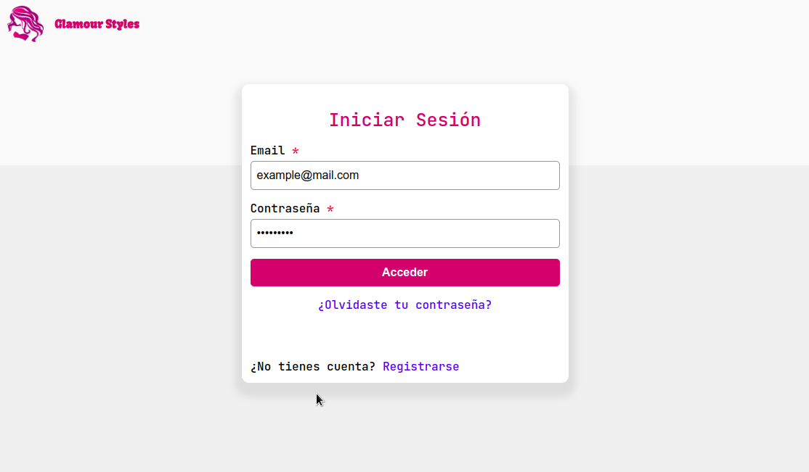
    </div>
    <div>
        <p style="font-size: 12px;">Ingresa tus datos de registro</p>
        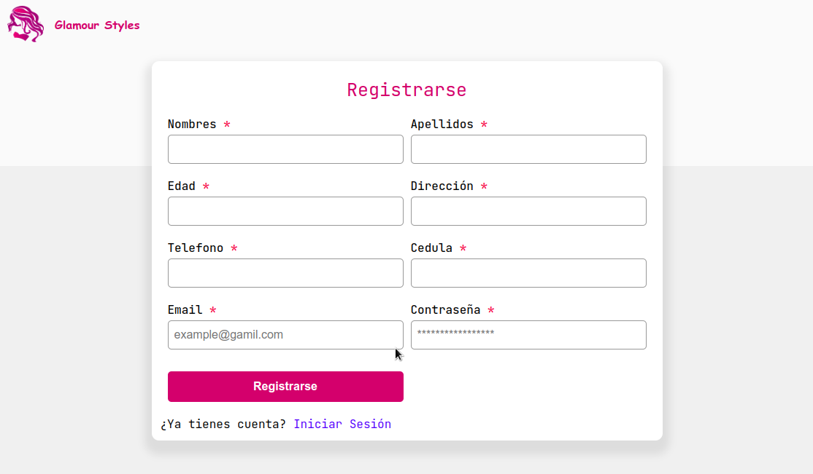
    </div>
    <div>
        <p style="font-size: 12px;">Ingresa tu email y te llegará un correo con indicaciones</p>
        
    </div>
    <div>
        <p style="font-size: 12px;">Correo con las indicaciones</p>
        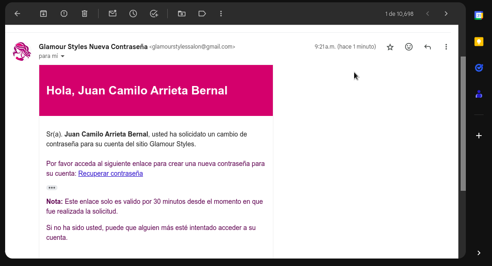
    </div>
</article>

Ten en cuenta que para el envío de correos debes configurar el servidor SMTP (Simple Mail Transfer Protocol) del PHPMailer y agregar el email predeterminado de donde se enviarán los correos, en **PHPMailer/email.php**

```php
$this->mail->CharSet = "UTF-8"; //Enable verbose debug output
$this->mail->isSMTP(); //Send using SMTP
$this->mail->Host       = 'smtp.example.com'; //Set the SMTP server to send through
$this->mail->SMTPAuth   = true; //Enable SMTP authentication
$this->mail->Username   = 'example@mail.com'; //SMTP username
$this->mail->Password   = 'your_password'; //SMTP password
$this->mail->SMTPSecure = PHPMailer::ENCRYPTION_SMTPS; //Enable implicit TLS encryption
$this->mail->Port       = 465;  
```

## Agendamiento de turno

Mediante los siguientes pasos se pueden agendar turnos. Primero se selecciona el servicio, luego se debe escoger el estilista con el cual se desea realizar el servicio, al hacer click sobre el botón agendar se llevará a un calendario en relación con el estilista escogido, se debe seleccionar el dia en el calendario y se mostrará la ventana modal donde puede asignar el evento de turno.

<article style="display: grid; grid-template-columns: repeat(auto-fill, minmax(min(320px, 100%), 1fr)); gap: 10px">
    <div>
        <p style="font-size: 12px;">Selecciona el servicio deseado</p>
        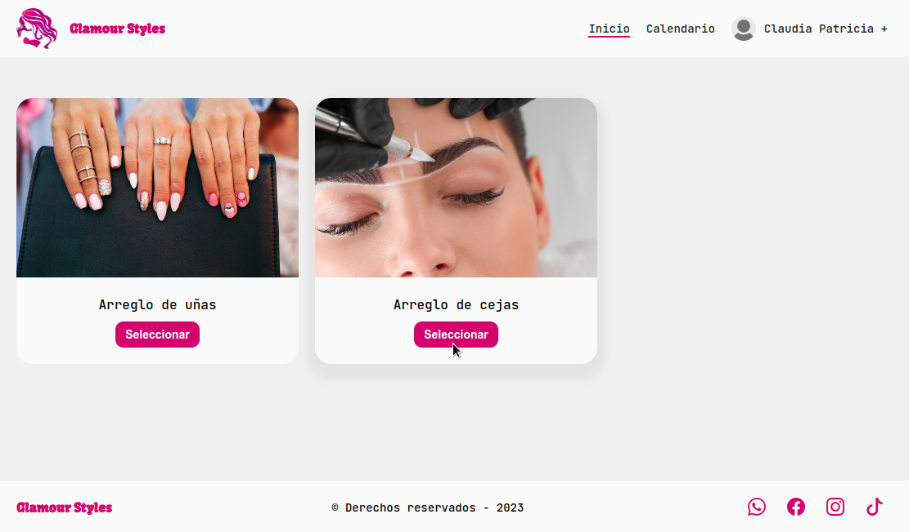
    </div>
    <div>
        <p style="font-size: 12px;">Se escoge el estilista de preferencia</p>
        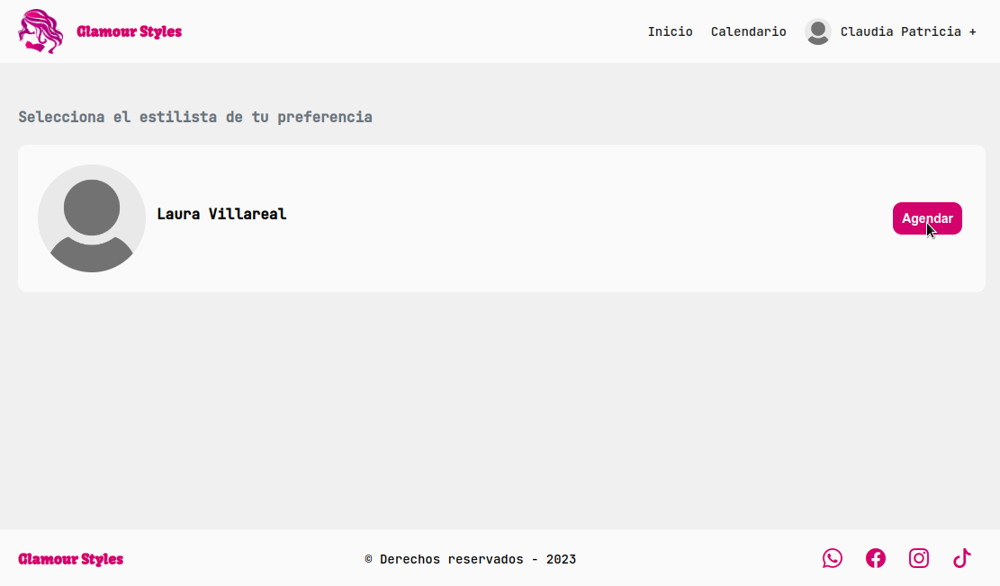
    </div>
    <div>
        <p style="font-size: 12px;">Al seleccionar un dia se muestra la ventana modal</p>
        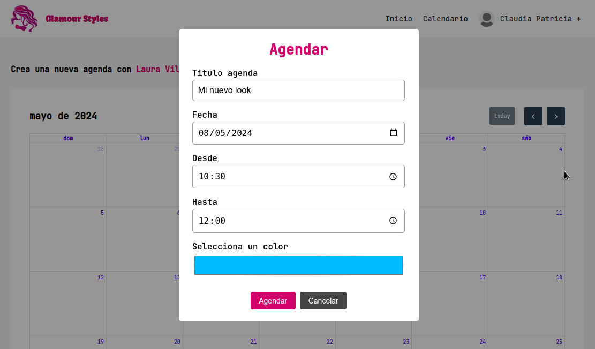
    </div>
    <div>
        <p style="font-size: 12px;">Así se observa un turno agendado</p>
        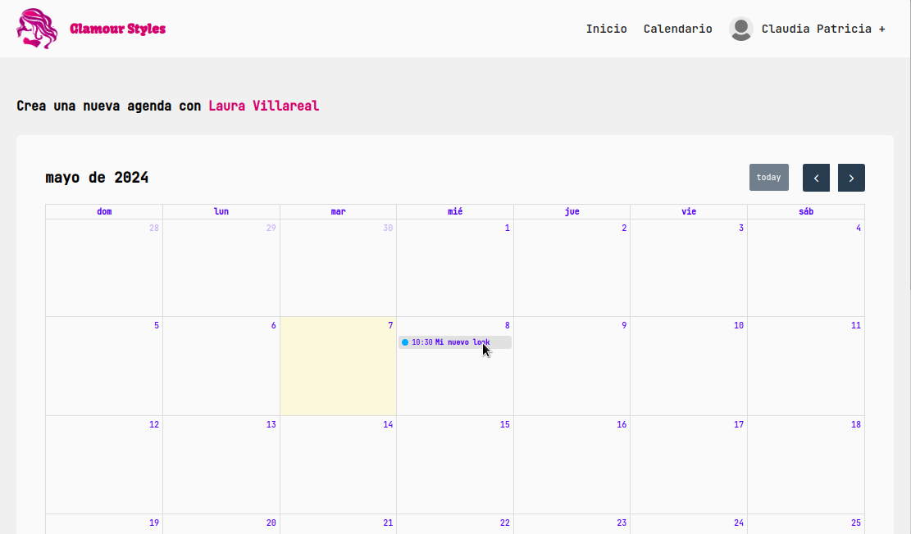
    </div>
    <div>
        <p style="font-size: 12px;">Al hacer click sobre un evento en la opción calendario</p>
        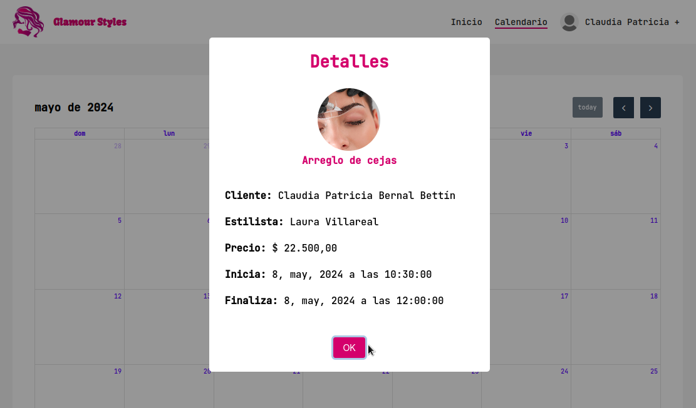
    </div>
    <div>
        <p style="font-size: 12px;">Al hacer click sobre un dia del calendario que ya tiene turnos</p>
        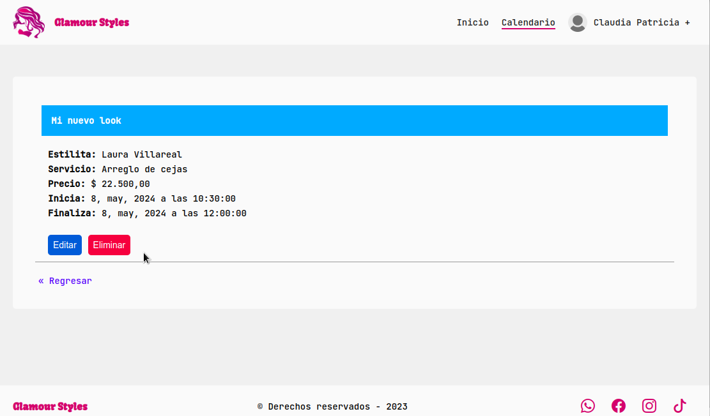
    </div>
    <div>
        <p style="font-size: 12px;">Se pueden editar los turnos agendados</p>
        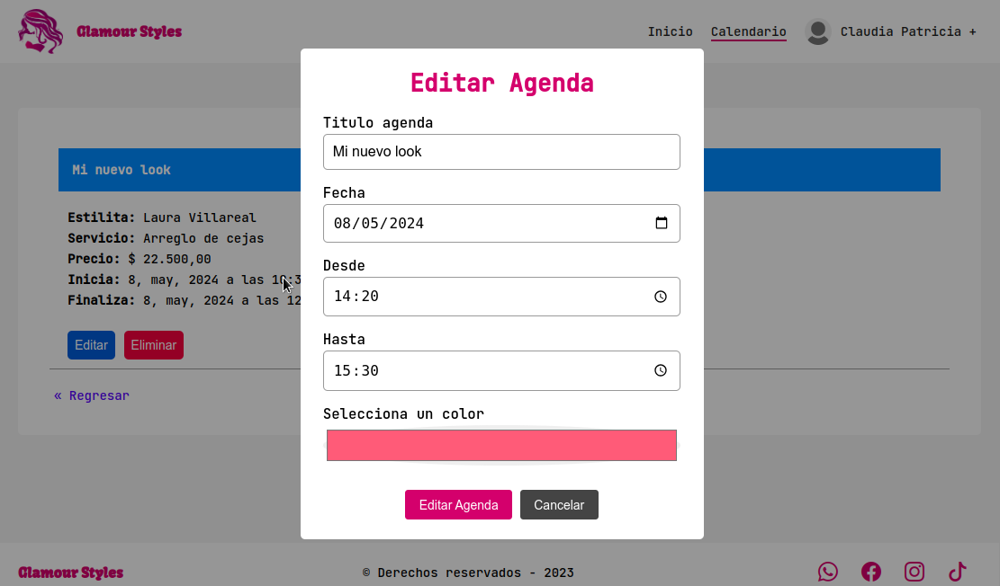
    </div>
    <div>
        <p style="font-size: 12px;">Agenda editada</p>
        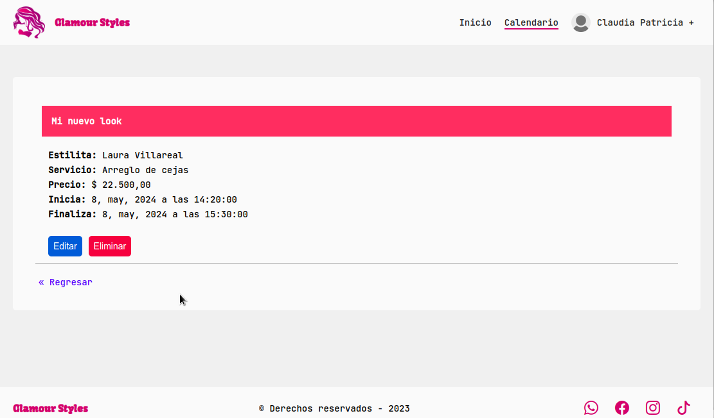
    </div>
     <div>
        <p style="font-size: 12px;">Eliminando una agenda</p>
        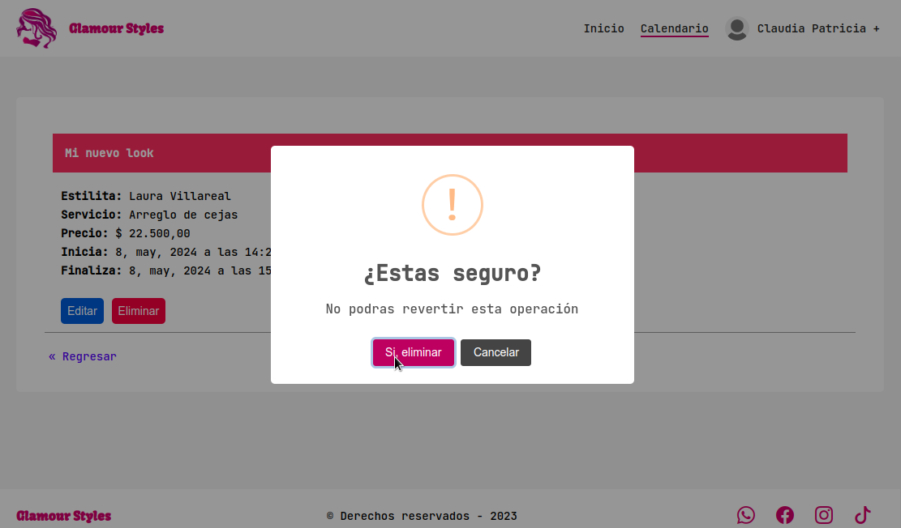
    </div>
     <div>
        <p style="font-size: 12px;">Agenda eliminada</p>
        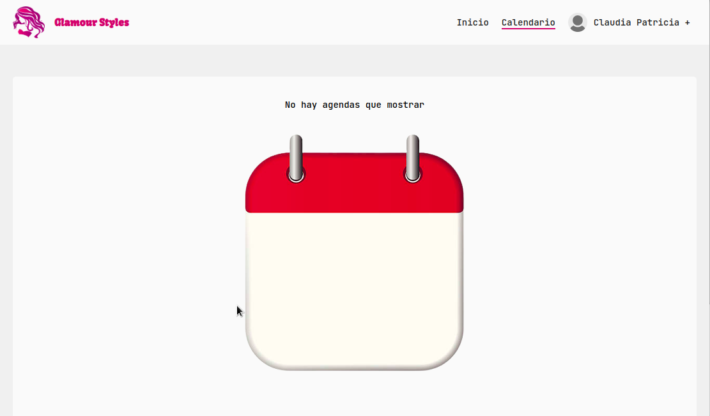
    </div>
     <div>
        <p style="font-size: 12px;">Regresando al calendario</p>
        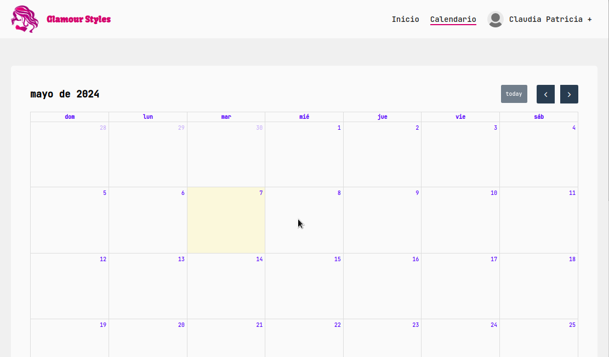
    </div>
</article>

## Administración

Aquellos usuarios con este rol pueden realizar diferentes operaciones dentro del sistema, como las llamadas CRUD, entre ellas, crear nuevos servicos, empleados, e incluso otros administradores. Asimismo pueden editar y eliminar información, también pueden observar los diferentes calendarios de cada estilista, verificar y marcar como cumplido cada turno agendado, a continuación una muestra de ello.

<article style="display: grid; grid-template-columns: repeat(auto-fill, minmax(min(320px, 100%), 1fr)); gap: 10px">
    <div>
        <p style="font-size: 12px;">Gestión de servicios</p>
        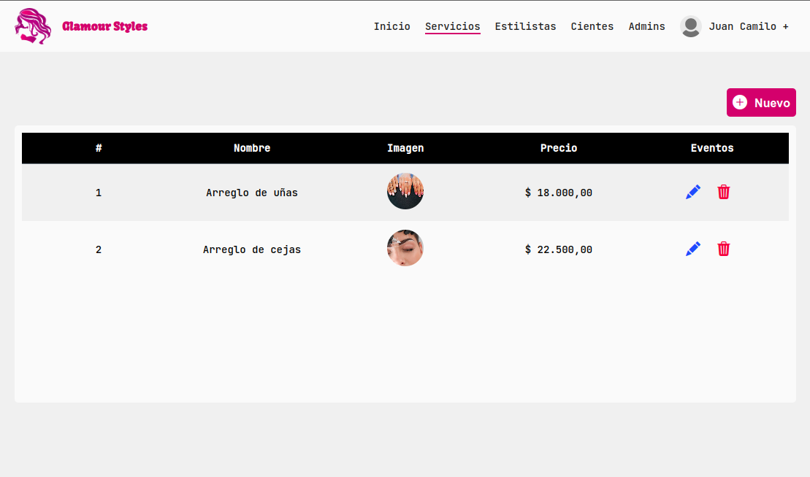
    </div>
    <div>
        <p style="font-size: 12px;">Gestión de estilistas</p>
        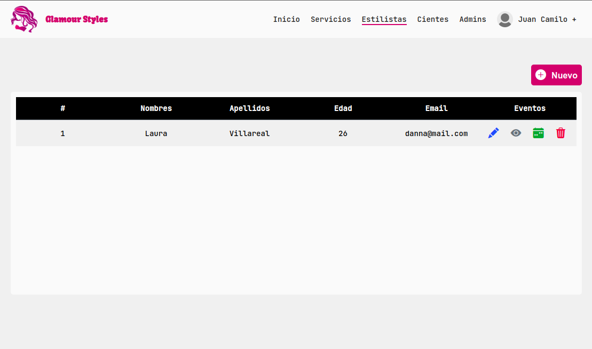
    </div>
    <div>
        <p style="font-size: 12px;">Calendario con los eventos del estilista escogido</p>
        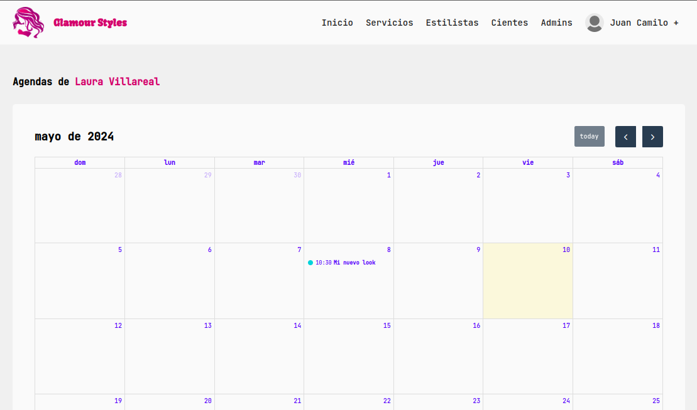
    </div>
    <div>
        <p style="font-size: 12px;">Se marca si el servicio fue realizado</p>
        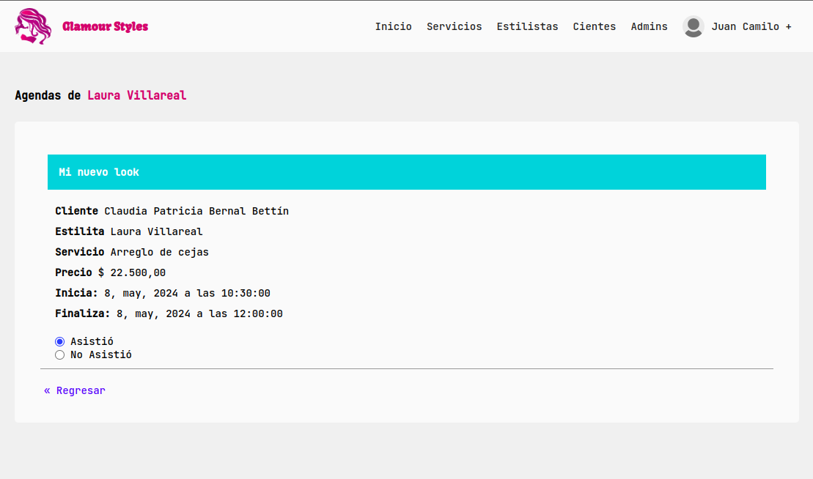
    </div>
</article>

## Instalación y Tecnologías

Las tecnologías usadas en este proyecto son: PHP, JavaScript, MySQL, HTML, CSS y Apache Server. También se usaron los CDN de librerias de JavaScript como [SweetAlert2](#) para las ventanas de alertas y modales, además, de [FullCalendar](#) para la visualización del calendario.  

Para obtener el sistema primero clona o descarga el repositorio

```bash
git clone https://github.com/Juancamilo21/glamour-styles.git
```
Luego crea la base de datos en MySQL, el archivo **database/glamour_styles_database.sql** debes importarlo en el cliente que utlizas para gestionar tus bases de datos por ejemplo: DBeaver, MySQL Workbench o cualquier otro que utilices. Luego debes ajustar las credenciales de tu base de datos en el archivo php que contiene la configuración de la base datos **config/database.php**

```php
$this->dbHost = "db_host";
$this->dbUser = "db_user";
$this->dbPassword = "db_password";
$this->dbName = "db_name";
```
Ten en cuenta que esto se puede ejecutar localmente o remotamente, solo debes obtener un servidor **Apache** y una base de datos MySQL. Si lo ejecutas localmente debes realizar los pasos siguientes: si estas en un SO basado en UNIX e instalas **Apache2** debes poner el directorio del proyecto en la ruta **/var/www/html** pero si estas en Windows debes instalar un cliente que te proporcione el servidor como puede ser **Xampp o Laragon** u otro de tu preferecia. Pero si lo despliegas remotamente solo sigue las indicaciones del proveedor. 
